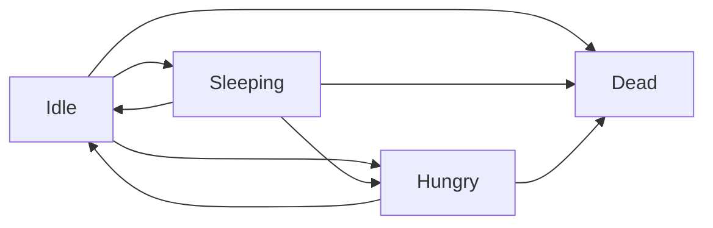

## states

## actions

- should die      [1] its conditions
- should hungry   [?] its conditions and only if not dead or sleep
- should sleep    [?] its conditions and only if awaken
- should wake up  [?] its conditions and only if asleep
- go eat          [?] its conditions and only if not dead or sleep

